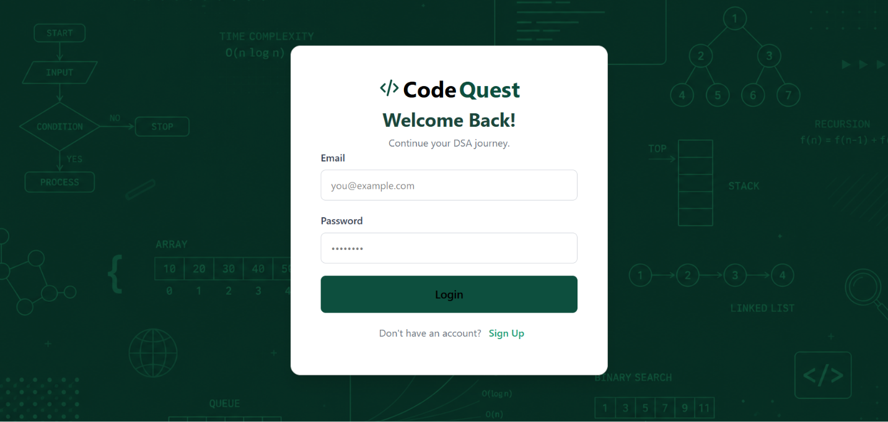
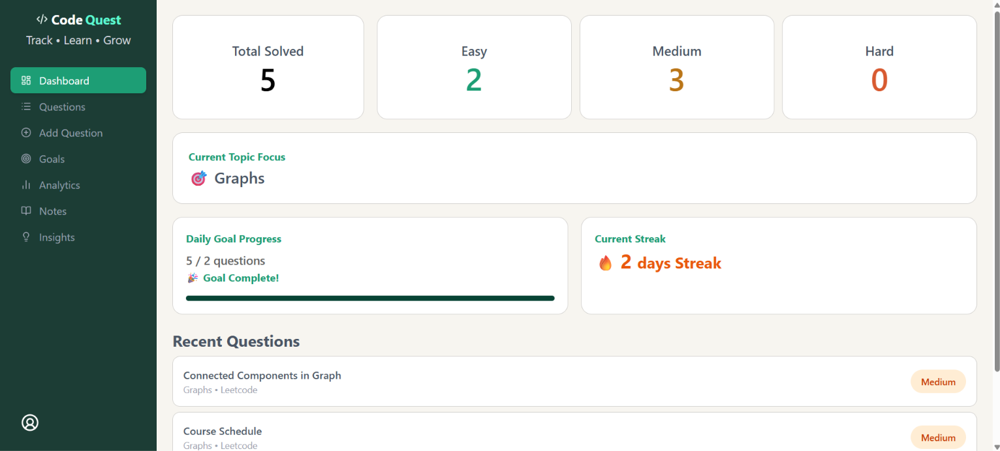
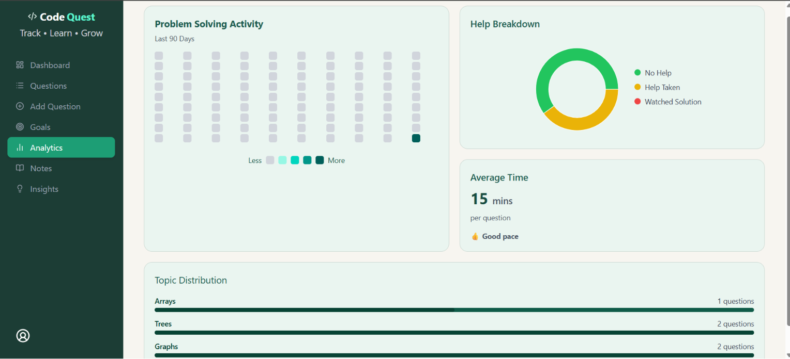
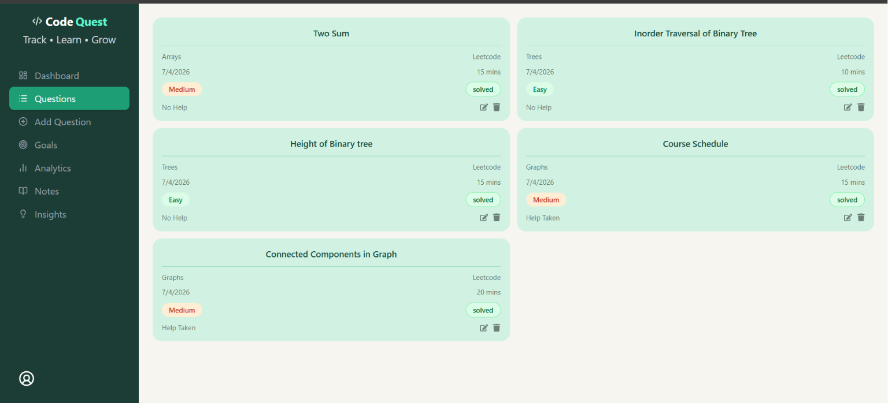
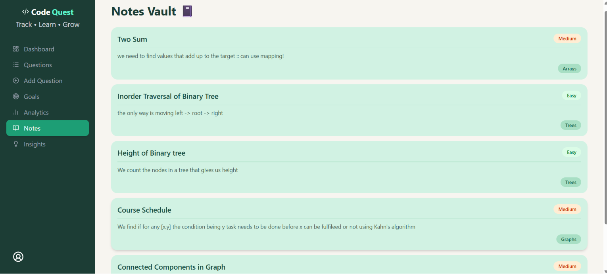
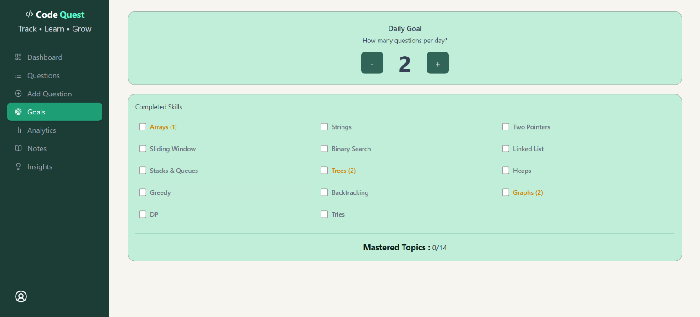

# CodeQuest

**Live Demo → [codequest-zeta-sable.vercel.app](https://code-quest-phi-six.vercel.app/)**

---

## Overview

CodeQuest is a full-stack DSA tracking platform that helps developers monitor their problem-solving journey through analytics, streak tracking, progress insights, and personalized coaching metrics. It combines productivity features with data visualization to help users stay consistent and identify learning patterns.

---

## Highlights

```
✓ Full-stack MERN application
✓ JWT authentication with bcrypt password hashing
✓ MongoDB persistence with user-scoped data isolation
✓ Server-side streak calculation (timezone-consistent)
✓ 90-day activity heatmap
✓ 7 custom insight algorithms
✓ Interactive analytics dashboard
✓ Responsive design — mobile + desktop
✓ Deployed on Vercel + Render
```

---

## Screenshots

| Login | Dashboard |
|---|---|
|  |  |

| Analytics | Questions |
|---|---|
|  |  |

| Notes Vault | Goals |
|---|---|
|  |  |

---

## Features

- **Dashboard** — total solved, difficulty breakdown, daily goal progress, current streak, recent questions
- **Question Tracker** — log questions with topic, difficulty, platform, time taken, help level, and notes
- **Analytics** — 90-day activity heatmap, topic distribution, help breakdown, average solve time
- **Notes Vault** — per-question notes persisted across all devices
- **Goals** — backend-persisted daily target with topic mastery tracking
- **Insights Engine** — 7 coaching algorithms that surface patterns in your solving behaviour

### Insights Engine

| Insight | What it detects |
|---|---|
| Consistency | Streak health and daily activity |
| Help Dependency | Over-reliance on hints or solutions |
| Topic Coverage | Neglected topics across the DSA roadmap |
| Least Touched | Topics with fewest questions logged |
| Speed Analysis | Average solve time and pace assessment |
| Difficulty Balance | Whether hard questions are being avoided |
| Topic Mastery | Topics with 15+ questions suggesting readiness to move on |

---

## Architecture

```
React (Vercel)
      ↓
Express API (Render)
      ↓
JWT Middleware
      ↓
Controllers
      ↓
MongoDB Atlas
```

---

## Tech Stack

| Layer | Technology |
|---|---|
| Frontend | React, Tailwind CSS, Recharts, React Router |
| Backend | Node.js, Express.js |
| Database | MongoDB, Mongoose |
| Auth | JWT, bcryptjs |
| Deployment | Vercel (client), Render (server) |

---

## Folder Structure

```
client/
├── components/
├── pages/
├── utils/
└── assets/

server/
├── controller/
├── middleware/
├── models/
└── routes/
```

---

## Local Setup

**Prerequisites:** Node.js, MongoDB Atlas account

```bash
git clone https://github.com/niyatipandey/CodeQuest
cd CodeQuest
```

**Backend**
```bash
cd server
npm install
```

Create `server/.env`:
```
MONGO_URL=your_mongodb_connection_string
JWT_SECRET=your_secret_key
PORT=3000
```

```bash
npm start
```

**Frontend**
```bash
cd client
npm install
npm run dev
```

Open `http://localhost:5173`

---

## Future Scope

- OAuth login (Google)
- Email verification and password reset
- Mobile PWA support
- AI-powered question recommendations
- Interview preparation mode
- Spaced repetition for weak topics

---

## Author

Niyati Pandey — [GitHub](https://github.com/niyatipandey)